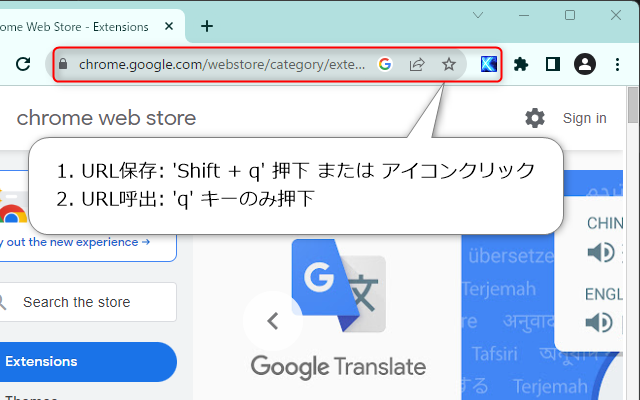

# Thunderswift Bookmark - Chrome 拡張機能

ショートカットキーにより素早く簡単にURLの保存と呼び出しを行うための拡張機能です。

## Language

- 日本語 (このページ)
- [English](https://github.com/signak/thunderswift_bookmark/blob/master/readme.md)

## 機能

| 機能       | 概要 |
| ---        | --- |
| URL保存    | 'Shift' + 割り当てたキーの押下で表示中のURLを保存（拡張機能のアイコンクリックでも可能） |
| URL呼出    | 割り当てたキーの押下で保存したURLの呼び出し |
| キー変更   | 割り当てキーの変更（オプション） |
| URL履歴    | 保存したURLの履歴（オプション） |
| フィルター | この拡張を有効にするサイトのURL設定（オプション） |

## 権限

- activeTab: アクティブタブに表示されているサイトのURL取得と、アクティブタブへ任意のURLの読み込みを行います。
- storage: 各種設定およびURLをローカルストレージに保存します。
- host: アクティブタブに表示される全てのサイトでURLを取得し、同様に保存したURLを開くため、全てのサイトへのアクセス権を要求します。

## インストール

- 推奨： [chrome ウェブストア](https://chrome.google.com/webstore/detail/thunderswift_bookmark/lfoloedjefmpcdfmllnppimdejojllbf) からのインストール
- もし手動でインストールする場合はリポジトリをダウンロードし、 package ディレクトリを任意の場所に配置して利用してください。

## ライセンス

- [MIT License](https://github.com/signak/thunderswift_bookmark/blob/master/LICENSE)
([邦訳](https://github.com/signak/thunderswift_bookmark/blob/master/docs/ja/LICENSE))

## サードパーティ ライブラリ

- [SPECTRE.CSS](https://picturepan2.github.io/spectre/index.html) v0.5.9 | Licensed under the [MIT License](https://github.com/picturepan2/spectre/blob/master/LICENSE).

## 支援

