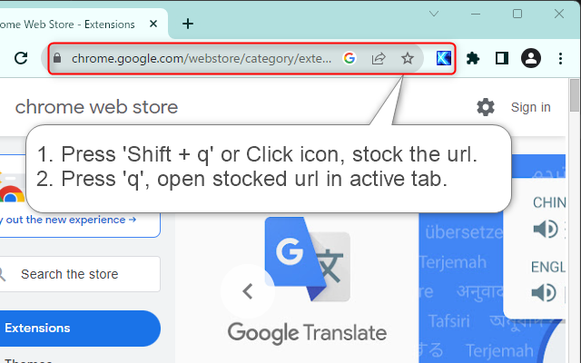

# Thunderswift Bookmark - Chrome Extension

<!-- 

 -->

## Language

- [Japanese](https://github.com/signak/thunderswift_bookmark/blob/master/docs/ja/readme.md)
- English (This page.)

This extension assists to stock URLs and access quickly any one of them.

## Features

| Features   | Description |
| ---        | --- |
| Store URL  | Shift' + 'assigned key' saves the currently displayed URL. (can also be done by clicking on the extension icon.) |
| Navigate   | move to the saved URL by pressing only 'assigned key'. |
| Key Config | Change assigned key (optional) |
| History    | Use history of saved URLs (optional) |
| Filtering  | URL setting for the url that will enable this extension (optional) |

## Permissions

- activeTab: Get the current URL and navigate to any site.
- storage: Used to store URLs and your settings. (settings and URLs are stored to local storage.)
- host: Access to all URLs is required to save the URL of the active tab in the user's operation and open that URL while viewing any site.

## Installation

<!-- - Recommended: install from [chrome web store](https://chrome.google.com/webstore/detail/thunderswift_bookmark/lfoloedjefmpcdfmllnppimdejojllbf) -->
- Recommended: install from chrome web store (Waiting for review)
- If you want to install it manually, download this repository and place 'package' directory in your desired location.

## License

[MIT License.](https://github.com/signak/thunderswift_bookmark/blob/master/LICENSE)

## Third Party Libraries

- [SPECTRE.CSS](https://picturepan2.github.io/spectre/index.html) v0.5.9 | Licensed under the [MIT License](https://github.com/picturepan2/spectre/blob/master/LICENSE).

## Donation

